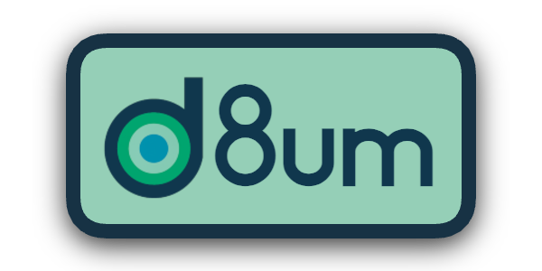

<p align="center">
  
</p>

<div align="center">
  <b>A context and memory SDK for agents.</b>
</div>

---

<p align="center">
  
  
  
  
</p>

[Quick Start](#quick-start)  •  [Cognitive Memory](#cognitive-memory)  •  [How It Works](#how-it-works)  •  [Benchmarks](#benchmarks)  •  [Packages](#packages)  •  [Guides](#guides)  •  [Contributing](#contributing)

**d8um** (pronounced "datum") is a TypeScript SDK that gives AI agents both **retrieval and memory** in a single composable package. Ingest any data source, search with hybrid retrieval, and give your agent cognitive memory - episodic recall, semantic knowledge, procedural learning - without Python, without a graph database, and without stitching together a gaggle of different tools.

## Why d8um?

Building a memory-capable agent in TypeScript today means cobbling together a vector DB, a graph DB, an embedding API, a caching layer, consolidation logic, and a conversation manager. The leading frameworks ([Graphiti](https://github.com/getzep/graphiti), [Mem0](https://github.com/mem0ai/mem0), [MemOS](https://github.com/MemTensor/MemOS)) are Python-first. **TypeScript has nothing equivalent.**

d8um closes that gap:

- **Retrieval + memory in one SDK** - not two separate tools bolted together
- **TypeScript-native** - no Python runtime, no managed service, no vendor lock-in
- **Vercel AI Gateway + Neon Postgres** - production-ready with pgvector, access 40+ model providers through one dependency
- **Vercel AI SDK integration** - memory tools and middleware for `generateText()` / `streamText()`
- **Composable** - works alongside your stack, not inside a framework
- **Per-bucket embedding models** - different models for different content, merged at query time via RRF

## Quick Start

**Prerequisites:** A [Neon](https://neon.tech) Postgres database. `deploy()` automatically enables the pgvector extension and creates all required tables.

```bash
npm install @d8um-ai/core @d8um-ai/adapter-pgvector @ai-sdk/gateway @neondatabase/serverless
```

```ts
import { d8um } from '@d8um-ai/core'
import { PgVectorAdapter } from '@d8um-ai/adapter-pgvector'
import { gateway } from '@ai-sdk/gateway'
import { neon } from '@neondatabase/serverless'

const config = {
  embedding: {
    model: gateway.embeddingModel('openai/text-embedding-3-small'),
    dimensions: 1536,
  },
  vectorStore: new PgVectorAdapter({ sql: neon(process.env.DATABASE_URL!) }),
}

// One-time setup - creates tables (run once, e.g. in a setup script or CI)
await d8um.deploy(config)

// Runtime init - lightweight, no DDL (safe for serverless cold starts)
await d8um.initialize(config)

// Create a bucket
const faq = await d8um.buckets.create({ name: 'faq' })

// Ingest documents (batched embedding via AI Gateway)
await d8um.ingest(faq.id, [{
  title: 'How do I set up SSO?',
  content: 'Navigate to Settings > Authentication and select your identity provider.',
  updatedAt: new Date(),
  metadata: {},
}], { chunkSize: 512, chunkOverlap: 64, deduplicateBy: ['content'] })

// Query - vector search by default, composable signals for more retrieval systems
// Identity fields (tenantId, groupId, userId, agentId, conversationId) filter results
const { results } = await d8um.query('how do I configure SSO?')

// Assemble into LLM-ready context
const context = d8um.assemble(results, { format: 'xml' })
```

Swap models by changing a string - `'openai/text-embedding-3-small'` → `'cohere/embed-english-v3.0'` - no dependency changes needed.

### Lifecycle

d8um separates infrastructure provisioning from runtime initialization:


| Method               | When to call                | What it does                                          |
| -------------------- | --------------------------- | ----------------------------------------------------- |
| `deploy(config)`     | Once (setup script, CI/CD)  | Creates tables and extensions. Idempotent.            |
| `initialize(config)` | Every app boot / cold start | Loads state, registers adapters. Lightweight, no DDL. |
| `undeploy()`         | Intentional teardown        | Drops all d8um tables. Refuses if any table has data. |
| `destroy()`          | App shutdown                | Closes adapter connections.                           |


For local development or scripts, `d8umCreate(config)` is a convenience that calls both `deploy()` and `initialize()`.

> **More setup options:** [Self-Hosted (pgvector)](guides/Self%20Hosted/setup.md) | [Local Dev (SQLite)](guides/Local%20Dev/getting-started.md) | [d8um Cloud](guides/d8um%20Cloud/quickstart.md)

## Cognitive Memory

d8um includes a **cognitive memory system** inspired by human memory. Memory operations live directly on the d8um singleton - identity is per-call, Segment-style:

```ts
import { d8umCreate, aiSdkLlmProvider } from '@d8um-ai/core'
import { createGraphBridge } from '@d8um-ai/graph'
import { gateway } from '@ai-sdk/gateway'

const llm = aiSdkLlmProvider({ model: gateway('openai/gpt-5.4-mini') })

const d = await d8umCreate({
  vectorStore: adapter,
  embedding: {
    model: gateway.embeddingModel('openai/text-embedding-3-small'),
    dimensions: 1536,
  },
  llm,
  graph: createGraphBridge({ memoryStore, embedding: model, llm }),
})

// Remember facts - identity is per-call, not ambient
await d.remember('Alice works at Acme Corp', { userId: 'alice', tenantId: 'org1' })

// Correct knowledge
await d.correct('Actually, Alice moved to Beta Inc', { userId: 'alice', tenantId: 'org1' })

// Ingest conversations with automatic fact extraction
await d.addConversationTurn(messages, { userId: 'alice' })

// Recall memories for context
const memories = await d.recall('Where does Alice work?', { userId: 'alice', tenantId: 'org1' })

// Build formatted memory context for LLM prompts
const context = await d.assembleContext('Tell me about Alice', { userId: 'alice' }, {
  includeFacts: true,
  includeEpisodes: true,
  format: 'xml',
})
```

> **Deep dive:** [Agentic Memory Guide](guides/Agentic%20Memory/overview.md) - memory types, lifecycle, extraction pipeline, landscape analysis

## How It Works

d8um uses **composable query signals** - the caller chooses which retrieval systems to activate:


| Signal    | What It Does                                   | Default |
| --------- | ---------------------------------------------- | ------- |
| `vector`  | ANN vector search against chunk embeddings     | **On**  |
| `keyword` | BM25 keyword search, fused with vector via RRF | Off     |
| `graph`   | PPR graph traversal via entity embeddings      | Off     |
| `memory`  | Cognitive memory recall (facts, episodes)      | Off     |


Signals compose freely - any combination works. The default (`{ vector: true }`) gives fast vector-only search (~10-30ms). Add signals for richer retrieval:

```ts
// Default: fast vector search
d.query('sso')

// Vector + keyword (hybrid)
d.query('how do I configure SSO?', { signals: { vector: true, keyword: true } })

// All signals: vector + keyword + graph + memory
d.query('what did Alice say about the SSO migration?', {
  signals: { vector: true, keyword: true, graph: true, memory: true },
  userId: 'alice',
  tenantId: 'org1',
})

// Graph-only: entity-centric associative retrieval
d.query('how are Alice and Acme Corp connected?', {
  signals: { graph: true },
})
```

When `graph` and `llm` are configured, document indexing automatically builds a knowledge graph:

1. **Triple extraction** - each chunk is analyzed to extract entities (people, organizations, places, works, etc.) and their relationships as subject-predicate-object triples
2. **Entity resolution** - entities are deduplicated across chunks using a multi-tier resolver: exact match, trigram Jaccard fuzzy matching, and vector similarity with type guards
3. **Predicate normalization** - relationship types are canonicalized via a predicate ontology (~150 types) and synonym groups to prevent graph fragmentation
4. **Cross-chunk context** - entity context accumulates across chunks within a document, improving extraction consistency

At query time, enabling the `graph` signal seeds a **Personalized PageRank** walk from entities mentioned in the query, traversing the graph to surface associatively-connected passages across documents and memory. When combined with `vector` and `keyword` signals, results are fused via RRF, enabling multi-hop reasoning in a single retrieval step. Composite score weights are configurable per-query via `scoreWeights`, and graph result filtering is tunable via `graphReinforcement` (`'only'`, `'prefer'`, or `'off'`).

The extraction pipeline supports configurable LLMs - using a reasoning model for extraction produces dramatically higher-quality graphs (fewer entities, richer predicate vocabulary, zero noise edges) at the cost of slower ingestion.

> **Deep dive:** [Agentic RAG Guide](guides/Agentic%20RAG/overview.md) - hybrid search, per-model fan-out, embedding providers, architecture

## Benchmarks

d8um is evaluated on published academic benchmarks using the exact methodology (chunk sizes, scoring functions, context windows) from each source paper.

### Retrieval (Core)

Standard information retrieval benchmarks using vector + keyword signals (BM25 with RRF fusion). Metrics are BEIR-standard at cutoff 10.


| Dataset                 | nDCG@10    | Baseline | Delta       | Source           |
| ----------------------- | ---------- | -------- | ----------- | ---------------- |
| Australian Tax Guidance | **0.7519** | 0.7431   | **+0.0088** | MLEB Leaderboard |
| MLEB-ScaLR              | **0.6607** | 0.6528   | **+0.0079** | MLEB Leaderboard |
| License TLDR            | **0.6485** | 0.5985   | **+0.0500** | MLEB Leaderboard |
| MultiHop-RAG            | **0.6429** | -        | -           | COLM 2024        |
| Legal RAG Bench         | 0.3348     | 0.3704   | -0.0356     | MLEB Leaderboard |


Baselines are text-embedding-3-small on the [MLEB Leaderboard](https://huggingface.co/spaces/isaacus/MLEB) (Isaacus). d8um uses the same embedding model with chunked retrieval + document-level deduplication.

### Graph-RAG (Neural)

[GraphRAG-Bench](https://arxiv.org/abs/2506.05690) evaluates graph-augmented retrieval on long-form question answering over 20 Project Gutenberg novels. Scoring uses LLM-as-judge answer correctness (0.75 x factuality + 0.25 x semantic similarity) - a continuous 0.0-1.0 metric matching the paper's evaluation code.


| Rank   | System           | Fact Retrieval | Complex Reasoning | Contextual Summarize | Creative Generation | Overall  |
| ------ | ---------------- | -------------- | ----------------- | -------------------- | ------------------- | -------- |
| **#1** | **d8um neural**  | **61.7**       | 53.1              | 60.4                 | 47.7                | **58.4** |
| #2     | HippoRAG2        | 60.1           | **53.4**          | 64.1                 | **48.3**            | 56.5     |
| #3     | Fast-GraphRAG    | 57.0           | 48.5              | 56.4                 | 46.2                | 52.0     |
| #4     | GraphRAG (local) | 49.3           | 50.9              | **64.4**             | 39.1                | 50.9     |
| #5     | RAG w/ rerank    | 60.9           | 42.9              | 51.3                 | 38.3                | 48.4     |
| #6     | LightRAG         | 58.6           | 49.1              | 48.9                 | 23.8                | 45.1     |


d8um overall ACC (58.4%) is statistically significant over HippoRAG2 (56.5%) at 95% confidence [CI: 57.2%, 59.5%]. Full eval: 2,009 queries, GPT-5.4-mini generation. Baselines from arXiv:2506.05690 Table 3 (GPT-4o-mini generation). See `benchmarks/` for methodology and reproduction.

## Packages


| Package                                                                     | Description                                                           | Status |
| --------------------------------------------------------------------------- | --------------------------------------------------------------------- | ------ |
| **Core**                                                                    |                                                                       |        |
| `[@d8um-ai/core](packages/core)`                                               | Query engine, index engine, memory operations                         | Alpha  |
| `[@d8um-ai/adapter-pgvector](packages/adapters/pgvector)`                      | PostgreSQL + pgvector storage                                         | Alpha  |
| `[@d8um-ai/adapter-sqlite-vec](packages/adapters/sqlite-vec)`                  | SQLite + sqlite-vec - local dev / edge                                | Alpha  |
| `[@d8um-ai/hosted](packages/hosted)`                                           | Hosted client SDK                                                     | Alpha  |
| **Graph + Memory**                                                          |                                                                       |        |
| `[@d8um-ai/graph](packages/graph)`                                             | Knowledge graph, cognitive memory, PPR, entity linking, consolidation | Alpha  |
| `[@d8um-ai/mcp-server](packages/mcp-server)`                                   | MCP tools + resources for agent frameworks                            | Alpha  |
| `[@d8um-ai/vercel-ai-provider](packages/vercel-ai-provider)`                   | Vercel AI SDK memory tools + middleware                               | Alpha  |


## Guides


| Guide                                                                | What you'll learn                                                  |
| -------------------------------------------------------------------- | ------------------------------------------------------------------ |
| [Self-Hosted Setup](guides/Self%20Hosted/setup.md)                   | Neon Postgres + pgvector, AI Gateway, hybrid search internals      |
| [Getting Started (Local Dev)](guides/Local%20Dev/getting-started.md) | SQLite + AI Gateway - minimal infrastructure setup                 |
| [d8um Cloud](guides/d8um%20Cloud/quickstart.md)                      | Hosted API - just an API key                                       |
| [Agentic RAG](guides/Agentic%20RAG/overview.md)                      | Retrieval architecture, embedding providers, landscape analysis    |
| [Agentic Memory](guides/Agentic%20Memory/overview.md)                | Cognitive memory system, lifecycle, extraction, landscape analysis |


## Development

```bash
pnpm install          # Install dependencies
pnpm build            # Build all packages (Turborepo)
pnpm test             # Run tests
pnpm typecheck        # Type checking
```

## Contributing

d8um is open source and contributions are welcome - new integrations, adapters, bug fixes, or documentation.

1. Fork the repo
2. Create a feature branch (`git checkout -b feat/my-feature`)
3. Make your changes
4. Run `pnpm build && pnpm typecheck` to verify
5. Open a PR

## License

[MIT](LICENSE)